## The winner of the ASAB2025 logo competition: Alex Wishaw's "Abbey Road"

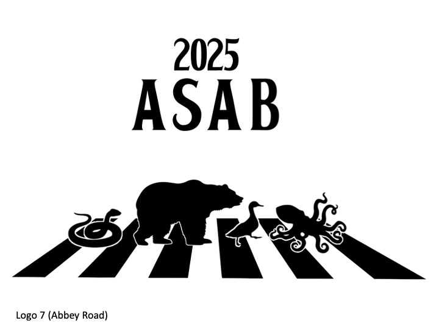 

## Runner up: 3rd year Biology student Amy Speers with "Liverbird:

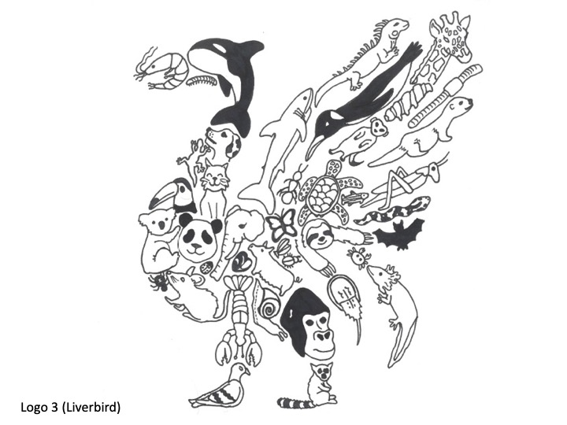 

# And a big thanks to all the other artists and their wonderful artwork: 

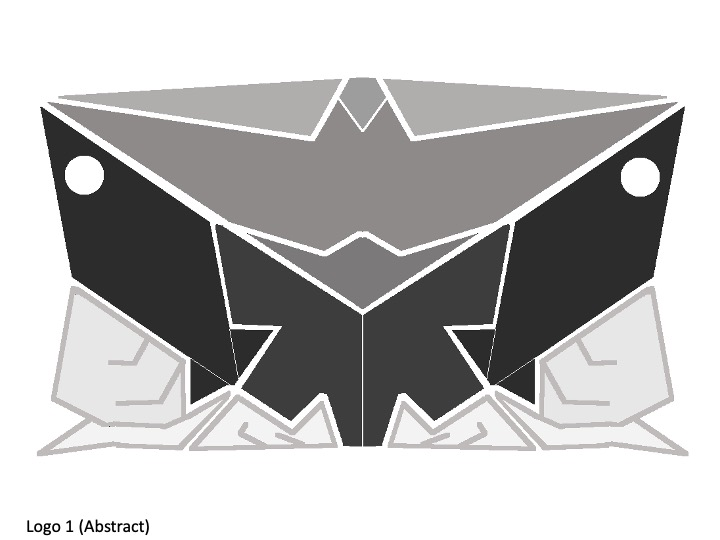 

  
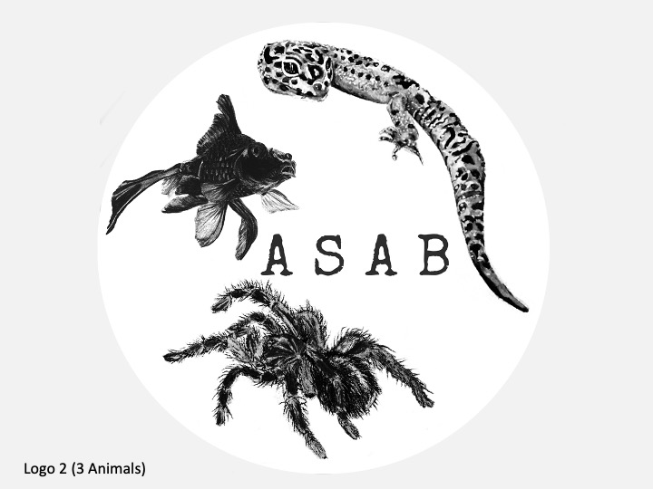 

  
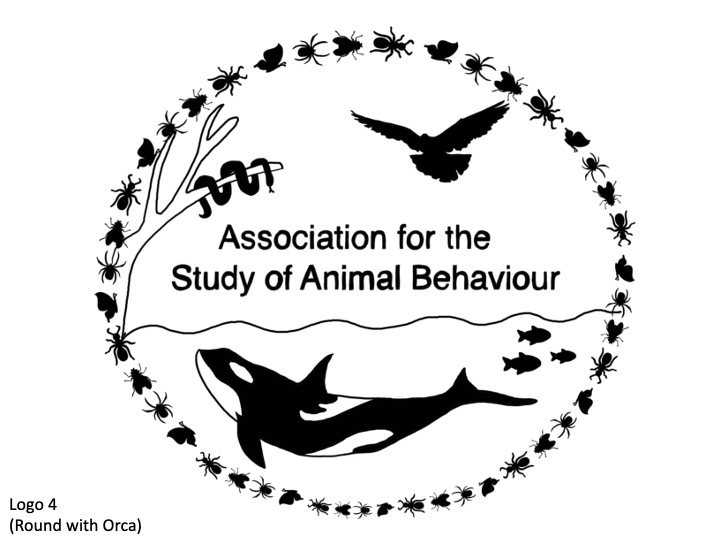 
   
## Logo5
  
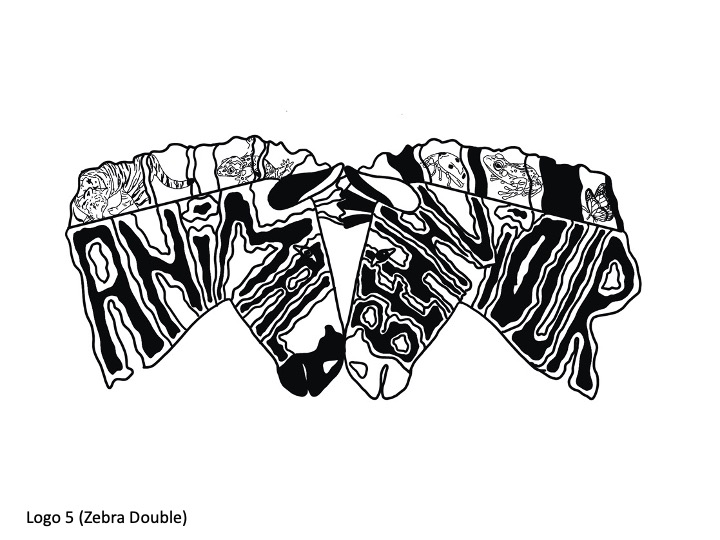 

   
## Logo6
  
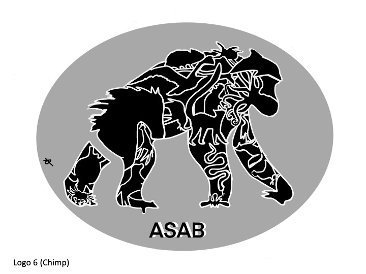 
   
## Logo7
  

   
## Logo8
  
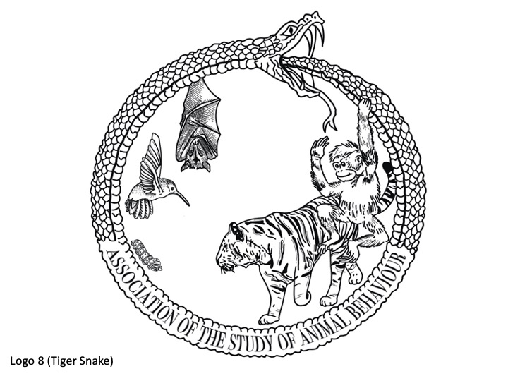 
   
## Logo9
  
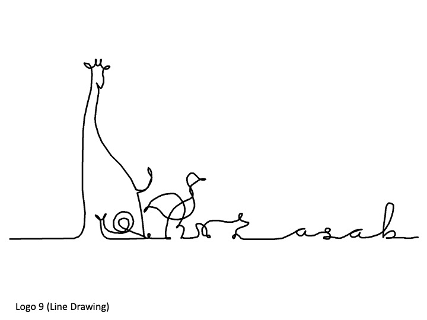 
   
## Logo10
  
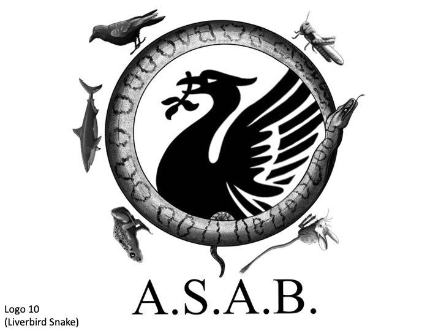 
   
## Logo11
  
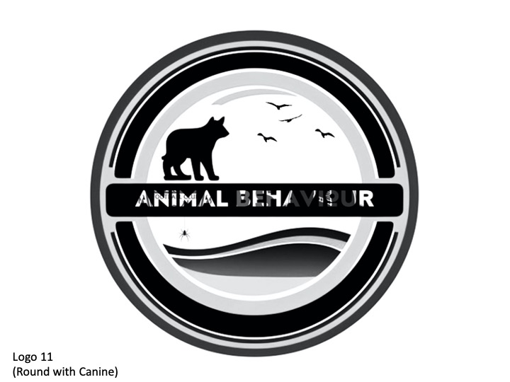 
   
## Logo12
  
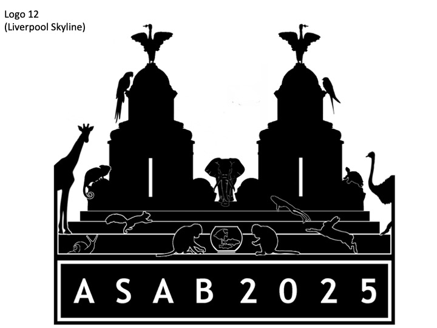 
   
## Logo13
  
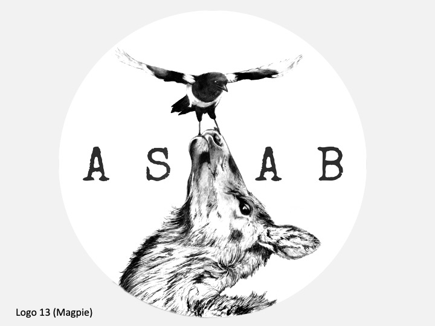 
   
## Logo14
  
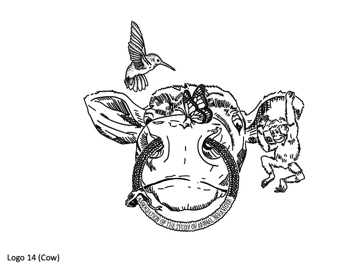 
    
## Logo15
  
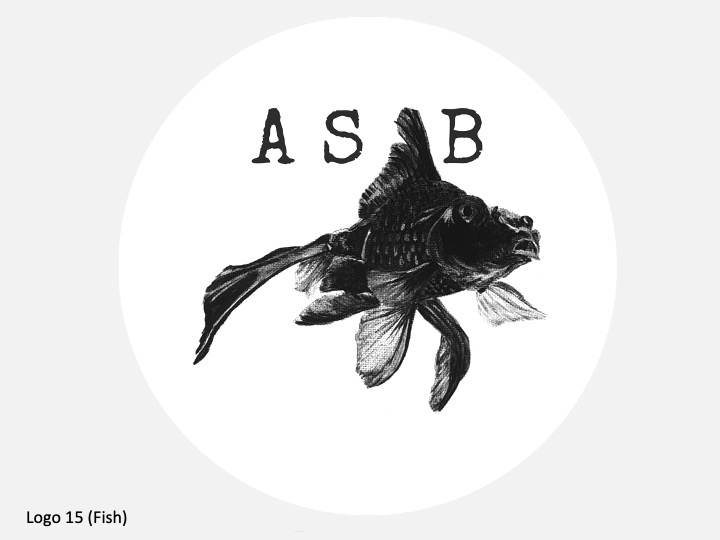 
   
## Logo16
  
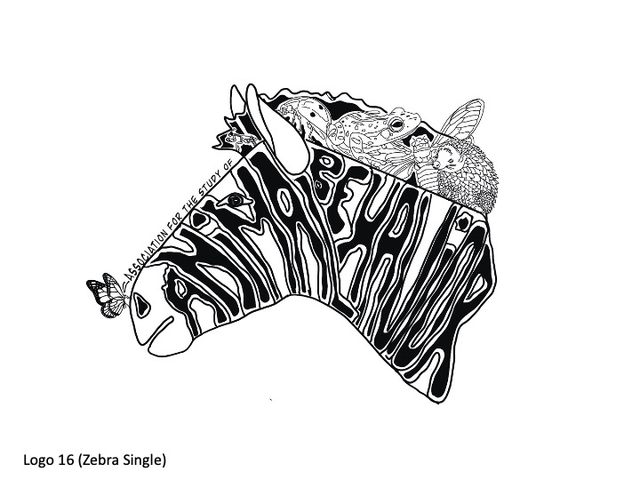 

