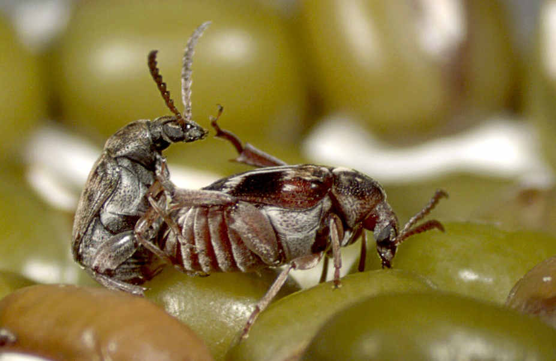
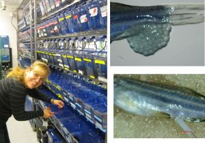
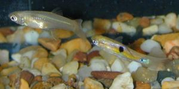
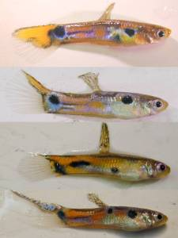

### Optimistic zebrafish    

How do personality and optimistic behaviour interact? Are bolder personality types alsso more optimistic? How can we influence animal "moods"? Are there sex differences in optimism? All these questions are still largely unknown, and we have only recently started exploring this field, in collaboration with the zebrafish team of the [Interdiscipliary Ecology and Evolution Lab](http://www.i-deel.org/), at UNSW.   

### Trangenerational consequences of maternal sexual interactions   

Sexual conflict, the fact that neither sex can optimise their reproductive  "ideal", is widespread. It is for example obervable in differences in mating rates (males typically would benefit from mating more often, which may have negative conequences for females). In some species, mating can be outright harmful for the females, if males transfer toxins with their ejaculate, or have developed spines and spikes on their intromitted organs to prolong the mating act. Investigating the transgenerational effects of different levels maternal sexual interactions is particularly interesting in short-lived insects, with high levels of sexual conflict. We use fruit flies, where the male transmits substances that enhance egg laying, supress re-mating and may affect female longevity, and seed beetles, which have evolved marmful intromitted organs, to investigate the direct and indirect consequences of mating.   
{:height="50%" width="50%"}

### The role of paternal transgenerational effects

Our research conducted with Simone Immler at Uppsala University drew on the emerging view on parental epigenetic inheritance. In zebrafish (*Danio rerio*) we studied how the paternal social environment mediates not only variation in male reproductive traits but also male reproductive success and trangenerationally transmitted offspring traits.   

### The interaction between population structure and behavior: studying dispersal   

During our postdoc at the CNRS in [Moulis (France)](http://www.ecoex-moulis.cnrs.fr/spip.php?article200) we primarily 
concentrated drawing the link between individual behaviour and  environmental common lizards (*Zootoca [formerly Lacerta] vivipara*). 
We found that the propensity to initiate movement is critically dependent on the type of substrate, the level of humidity, 
and the opportunity to thermoregulate. However, there are also indications that the social environment influences dispersal 
not only in respect to inbreeding and competition avoidance by the dispersing individuals, but that in the wild siblings may 
aim to facilitate the risky dispersal process for each other.

### Sexual selection and Inbreeding avoidance    

We investigated female mating behavior in guppies with a special focus on mechanisms related to inbreeding avoidance. We investigated findings on the negative effects of inbreeding on sperm quantity as well as inbreeding depression in sperm competition using artificial insemination techniques, and females preferences for mutivariate male ornamentation.   
{:height="50%" width="50%"} 

