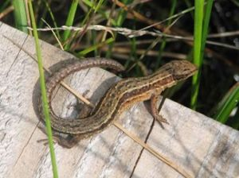
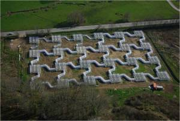
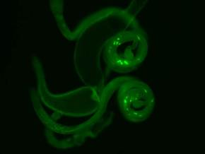

## Functional ecology   
How organisms respond to environmental factors is not only defined by behavioural characters, but to a large degree also by physiological factors. Studying underlying physiological mechanisms is vital for our understanding of phenotypic variation in traits and their evolutionary correlations.     
During the time at the CNRS we investigated the role of thermoregulation on locomotor performance in European wall lizards (Podarcis muralis), finding a potential trade-off for red ornamentation in males, which may help explain the maintenance of the colour polymorphism in this species.   

## Dispersal   
In 2010, we started to use a new experimental facility, called the Metatron, which consists of 48 cages (10x10m) that are connected by 20 meter long corridors (link to an article in a French newspaper about it). Corridors can be opened and closed individually to create self contained systems of connected cages, and environmental temperature and humidity conditions within cages can be manipulated. These features allow to test for dispersal decisions and strategies of individual common lizards, and how these are affected by interactions with other population members, e.g. through population density, relatedness, or by individual personality traits.   

## The significance of long sperm    
Fruit flies display an astounding variation in sperm length across closely related species, ranging from relatively short sperm in _D. melanogaster_ (1.8mm) to giant sperm in _D. bifurca_ (58mm). So far little is known about the genetics, ecology and evolutionary significance of this variation. We performed experiments on historical selection lines to investigate differences in behaviour and life history traits in relation to long and short male and female reproductive organs.

