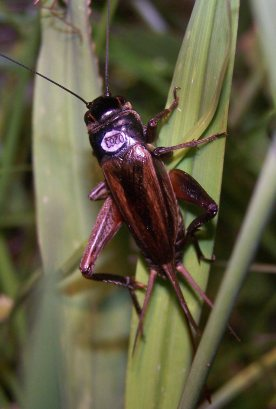
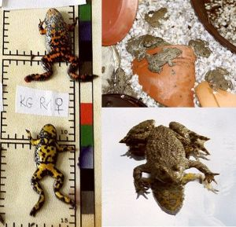
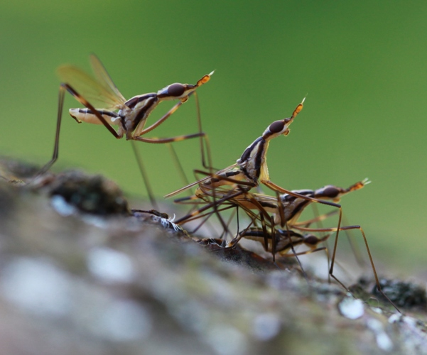

Life-history theory provides ultimate causes of why traits like development time, mortality before and after maturation, or fecundity should be shaped in a specific way, depending on what species or even population we look at. It is obvious that lifespan of an organism does affect its fitness. Maximum potential lifespan is not the same in organisms with similar metabolic rates, therefore a purely mechanistic explanation of senescence (‘wear and tear’) is not sufficient. Rates of ageing and senescence should depend on the genetic architecture and the evolutionary forces, mainly selection, that shaped them.

## GENETICS  
To investigate the genetic architecture underlying age-dependent fitness traits, Felix performed a quantitative genetic study, where he looked at the genetic correlations between the expression of fitness related traits early and late in life. These kinds of correlations are an important tenet in evolutionary theory of ageing, more exactly in the antagonistic pleiotropy theory. We tested not only for genetic relationships within the two separate sexes, but also between the sexes. This allowed us to evaluate whether sexual conflict is potentially important in constraining sex-specific independent evolution of increased fitness.
More estimates of the effect of intra-locus sexual conflict on ageing in various different taxa are needed to assess the importance and ubiquity of this mechanism for the evolution of sex-specific senescent phenotypes.   
{:width="40%"}  {:height="40%" width="40%"}

## DIET  
Caloric or, better, dietary restriction is another area we are interested in. Theory predicts that sexually selected traits should be costly, and that does not only mean in an immediate physiological way (e.g. ‘the more a cricket calls, the more energy it spends, the higher its immediate resource intake has to be’), rather with a life-history background of some kind of lifetime balance between acquisition and allocation of resources. So, by combining this assumption with the fact that dietary restriction has been shown to prolong lifespan in a wide range of organisms, we want to further explore the interface between sexual selection and ageing.   
{:height="50%" width="50%"}

## NATURAL POPULATIONS  
Ageing and senescence in animals in the wild has been neglected for a long time, because animals that show senescent signatures were thought not to occur in nature. After studies showed senescence in vertebrate, longer-lived animals, this belief was still held up for short-lived animals like insects. We know now from a handful of studies that invertebrate species can show senescence in their natural environment. In the field cricket, we used capture-mark-recapture methodology to show a senescent increase in mortality rate for males and females. To design and carry out good experiments on ageing in natural populations is very hard, because there are many confounding environmental variables, and because the sample sizes have to be substantial in order to estimate mortality rates or other age-dependent fitness correlates (especially in older age-groups). But most often, study species have evolved for hundreds and thousands of generations in a fluctuating environment where external mortality risk is high, compared to lab environments. This means that testing findings from the lab in the wild can tell us about their adaptive significance, and, vice versa, results from the wild can be used to design experiments in the lab, under more controlled circumstances, allowing to further disentangle the results from nature.
